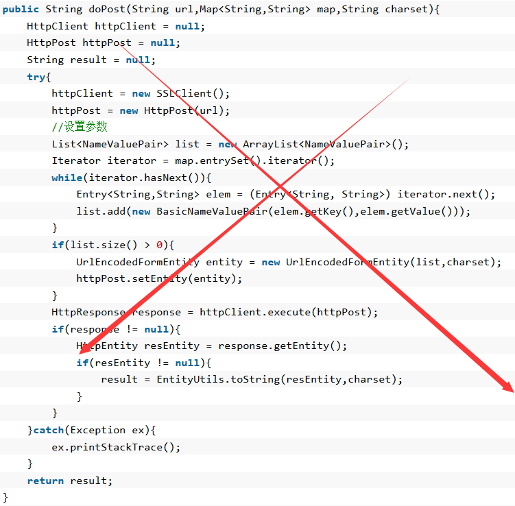
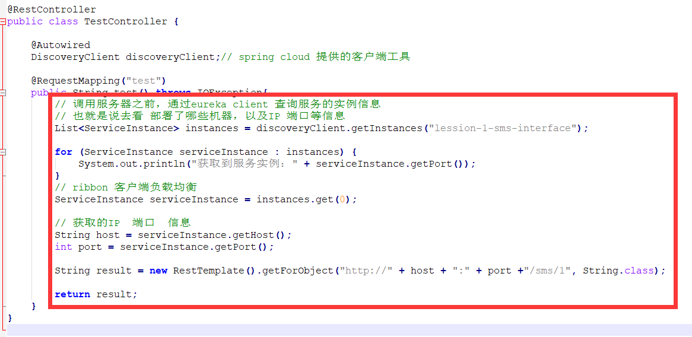
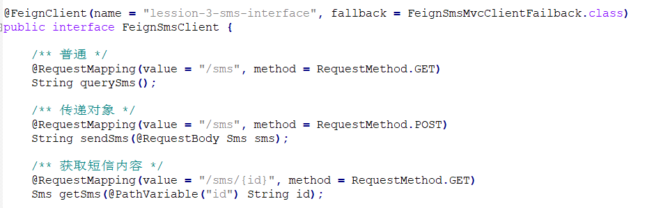
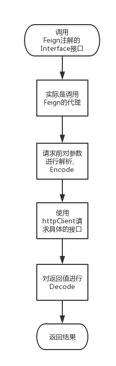

## Feign 客户端 服务调用
```text
服务 之间 调用方式：
1、直接使用 HttpClient，不友好；
2、DiscoveryClient + RestTemplate 调用 其他服务：DiscoveryClient获取实例信息，RestTemplate.getForObject("http://服务名/服务接口")
3、使用 feign对http调用进行封装，使用rpc就像使用普通 service一样，并且可以和eureka，ribbon，hystrix 等直接集成；
```




```text
Feign流程：
1、调用@FeignClient注释的Interface接口；
2、实际调用的是Interface的代理类；
3、请求前对参数进行编码Encode；
4、使用httpclient请求具体的接口，这里的httpclient代表一个用来发起http请求的工具，与负载均衡器Ribbon的集成就在这一步；
5、将返回的值进行解码；
6、返回结果；
```

```java
//
/**含义： 调用feignSmsClient.querySms() 想当于 调用 lesson-3-sms-interface服务的 /sms接口；
* Feign写法：interface绑定 服务名，interface方法绑定 服务uri接口，调用interface方法 相当于 调用 服务的uri
* */
@FeignClient(name="lesson-3-sms-interface",fallback = FallBack.class)
public interface FeignSmsClient{
    @RequestMapping(value = "/sms/{id}",method="RequestMethod.GET")
    public String querySms(@PathVariable("id") String id);
}
```
```text
项目组成：
1、lesson-3-eureka 服务作为 eureka服务端；2、lesson-3-sms-interface 服务作为服务提供者；3、lesson-3-feign-examples 服务作为客户端调用者；
lesson-3-feign-examples服务 pom.xml中引入 spring-cloud-starter-feign，启动类上面加@FeignClients注解，启动FeignClient，配置文件application.yml；
```
```xml
<dependency>
    <groupId>org.springframework.cloud</groupId>
    <artifactId>spring-cloud-starter-feign</artifactId>
</dependency>
```
```java
@SpringBootApplication
@EnableEurekaClient
@EnableFeignClients(defaultConfiguration=FeignClientsConfiguration.class)   //默认配置
public class FeignExampleApplication {
	public static void main(String[] args) {
		new SpringApplicationBuilder(FeignExampleApplication.class).web(true).run(args);
	}
}
```
```yaml
#application.yml
feign:
  hystrix:
    enabled: fale # true使用熔断机制；false不适用熔断机制
```
```text
Feign使用：1、结合Eureka使用；2、直接调用 url；
```
```java
/**1、Feign结合Eureka使用，eureka中 lesson-3-feign-examples服务 调用 eureka中 lesson-3-sms-interface服务的 /sms接口
* */
@FeignClient(name = "lesson-3-sms-interface", fallback = FeignSmsMvcClientFailback.class)
public interface FeignSmsClient {
    /**调用lesson-3-sms-interface服务的/sms接口，即发送GET请求http:lesson-3-sms-interface/sms*/
    @RequestMapping(value = "/sms", method = RequestMethod.GET)
    String querySms();
}
/**注意，FeignSmsClient接口里面使用什么风格注解，取决于启动类注解@EnableFeignClients(defaultConfiguration=FeignClientsConfiguration.class)
中的defaultConfiguration选择哪个注解解析器，此处选择的是FeignClientsConfiguration解析器；*/
```
```java
/**2、protogenesis包为 原生操作包，@FeignClient注解中 url作用：表示直接调用 url，不使用eureka了；
* configuration = SmsClientConfiguration.class表示每个Fiegn都可以做单独配置，但是 SmsClientConfiguration只能 托管给 每个子容器，保证不同到
* 子容器有 不同的配置*/
@FeignClient(url = "http://localhost:9002", configuration = SmsClientConfiguration.class)
public interface FeignSmsClient {
    /** 普通 */
    @RequestLine("GET /sms")
    String querySms();
    //...
}
/**注意，SmsClientConfiguration类上面不能加 @Configuration注解，如果加该注解，该实例会被加载到 spring父容器applicationContext中，会冲突，如果不加该注解，该实例会被加载到 spring子容器中，不会冲突；*/
public class SmsClientConfiguration {
	// 自定义http请求的工具
	@Bean
	Client apacheHttpClient() {
		return new ApacheHttpClient();
	}
	// 自定义请求超时时间
	@Bean
	Request.Options feignOptions() {
		return new Request.Options(1 * 1000, 1 * 1000);
	}
	// 自定义参数解析器
	@Bean
	public Contract feignContract(ConversionService feignConversionService) {
		return new feign.Contract.Default();
	}
}
```

```text
配置参数封装在 CommonClientConfigKey里面；
```
## Feign 客户端 服务调用 原理
```java
//启动类注解 EnableFeignClients是springcloud中 Feign的入口；
@Retention(RetentionPolicy.RUNTIME)
@Target(ElementType.TYPE)
@Import(FeignClientsRegistrar.class)
public @interface EnableFeignClients {
}
//ImportBeanDefinitionRegistrar 导入BeanDefinitionRegister
//1、FeignClientsRegistrar扫描 @FeignClient注释的interface，为其生成代理对象定义
class FeignClientsRegistrar implements ImportBeanDefinitionRegistrar,ResourceLoaderAware, BeanClassLoaderAware, EnvironmentAware {
    @Override
    public void registerBeanDefinitions(AnnotationMetadata metadata,BeanDefinitionRegistry registry) {
        //2、生成默认和指定的配置信息
        registerDefaultConfiguration(metadata, registry);
        //3、动态代理
        registerFeignClients(metadata, registry);
    }
}
```
