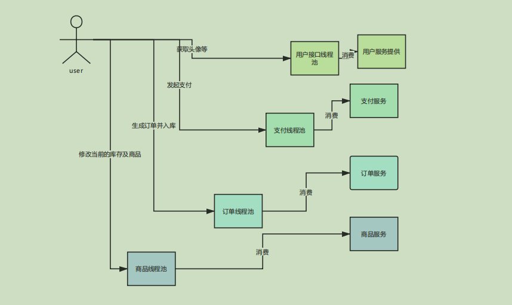
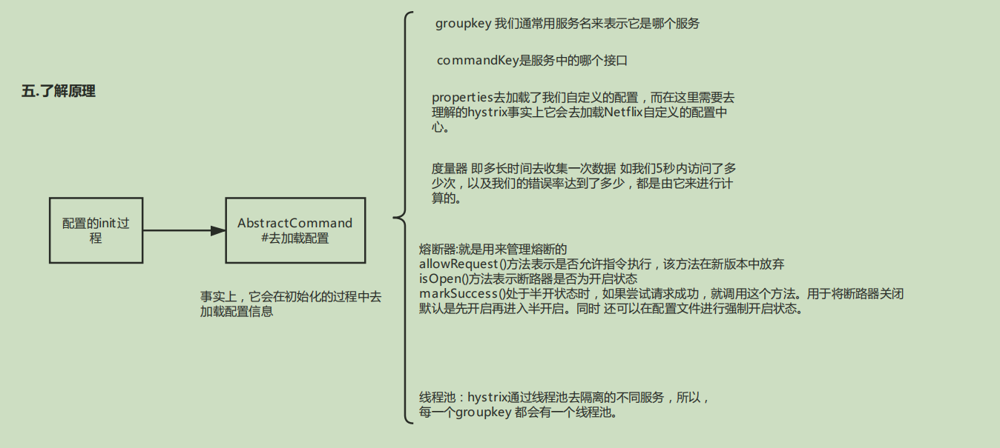

## Hystrix 限流 熔断 降级；Hystrix 属于 客户端调用者 限流 熔断 降级；服务端 也可以 限流 熔断 降级

```text
1、为什么用 Hystrix？
如下图所示，没有引入 Hystrix时，存在的问题：服务User Request 通过Tomcat线程池中的线程 调用 服务 A P H I，拿到正常结果，当服务 I响应超时的时候，Tomcat中的线程 一直不会被释放，当User Request请求增加时，越来
越多，Tomcat线程被占用，导致系统崩溃，因此引入Hystrix，当客户端调用者 调用 服务提供者 超时或超过最大并发量时，直接调 客户端调用者的 降级方法；
2、什么情况下使用？怎么用？
定义一个类 CommandForIndex 继承 HystrixCommand，这个类 CommandForIndex只是 针对provider-service服务的一个 /usr接口，很麻烦；
使用配置文件的方式 定义熔断信息 consumer-ribbon/config.propertis，hystrix启动时 会自动读取 config.properties，如果hystrix配置在application.yml
里，springboot会去读取
使用 @HystrixCommand 配置熔断 见 consumer-ribbon/ConsumerController，启动类加 @EnableCircuitClient，服务提供者 请求 数据库时，也可以配置熔断；
```
   

SpringCloud就是一个 AP模型，不用考虑 C 即一致性；

常见问题：经常 大面积降级，降级占比 5%-10%，超过该范围，对 用户不友好；
设置 Hystrix超时时间 = 调用的服务的 理论返回时间 + 可接受的超时时间；

Hystrix流程图：
客户端调用者 调用 服务提供者 返回404表示失败，返回200表示成功；

源码分析：
Hystrix流程：


CommandForIndex#CommandForIndex() 跟里面的super() → HystrixCommand#HystrixCommand() 跟里面的 super() → AbstractCommand#AbstractCommand()
AbstractCommand相当于 Hystrix的一个框架 模版；
protected AbstractCommand(HystrixCommandGroupKey group, HystrixCommandKey key, HystrixThreadPoolKey threadPoolKey, HystrixCircuitBreaker circuitBreaker, HystrixThreadPool threadPool, Setter commandPropertiesDefaults, com.netflix.hystrix.HystrixThreadPoolProperties.Setter threadPoolPropertiesDefaults, HystrixCommandMetrics metrics, AbstractCommand.TryableSemaphore fallbackSemaphore, AbstractCommand.TryableSemaphore executionSemaphore, HystrixPropertiesStrategy propertiesStrategy, HystrixCommandExecutionHook executionHook) {
    //...
    this.properties = initCommandProperties(this.commandKey, propertiesStrategy, commandPropertiesDefaults); //加载config.properties中特定的配置
    this.metrics = initMetrics(metrics, this.commandGroup, this.threadPoolKey, this.commandKey, this.properties);//初始化肚量桶 将一段时间 5000ms 分成 10份，每份500ms为一个度量器 统计收集信息
    this.circuitBreaker = initCircuitBreaker((Boolean)this.properties.circuitBreakerEnabled().get(), circuitBreaker, this.commandGroup, this.commandKey, this.properties, this.metrics);//初始化 熔断器
    this.threadPool = initThreadPool(threadPool, this.threadPoolKey, threadPoolPropertiesDefaults);
    //...
}

RxJava：
可以在 代码执行流中的每一步，加入 监听器，只懂流程即可，RxJava不用理解；


ConsumerController#index() → CommandForIndex#execute() 跟HystrixCommand#execute()方法 如下
public R execute() {
    try {
        return this.queue().get(); 跟 HystrixCommand#queue()，代码如下
    } 
}

public Future<R> queue() {
    // 返回 Future，说明 使用的是 观察者模式
}

手写超时降级 ，在com.dn.ribbon.futrue 包下

源码分析：
public R execute() {
    try {
        return this.queue().get(); 跟 HystrixCommand#queue()，代码如下
    } 
}

public Future<R> queue() {
    // 返回 Future，说明 使用的是 观察者模式
    final Future<R> delegate = toObservable().toBlocking().toFuture(); //跟 AbstractCommand#toObservable() 代码如下
}
//每个Action都是一个监听器，省略一部分
public Observable<R> toObservable() {
    final AbstractCommand<R> _cmd = this;

    //doOnCompleted handler already did all of the SUCCESS work
    //doOnError handler already did all of the FAILURE/TIMEOUT/REJECTION/BAD_REQUEST work
    final Action0 terminateCommandCleanup = new Action0() {

        @Override
        public void call() {
            if (_cmd.commandState.compareAndSet(CommandState.OBSERVABLE_CHAIN_CREATED, CommandState.TERMINAL)) {
                handleCommandEnd(false); //user code never ran
            } else if (_cmd.commandState.compareAndSet(CommandState.USER_CODE_EXECUTED, CommandState.TERMINAL)) {
                handleCommandEnd(true); //user code did run
            }
        }
    };

    return Observable.defer(new Func0<Observable<R>>() {
        @Override
        public Observable<R> call() {
             /* this is a stateful object so can only be used once */
            if (!commandState.compareAndSet(CommandState.NOT_STARTED, CommandState.OBSERVABLE_CHAIN_CREATED)) {
                IllegalStateException ex = new IllegalStateException("This instance can only be executed once. Please instantiate a new instance.");
                //TODO make a new error type for this
                throw new HystrixRuntimeException(FailureType.BAD_REQUEST_EXCEPTION, _cmd.getClass(), getLogMessagePrefix() + " command executed multiple times - this is not permitted.", ex, null);
            }

            commandStartTimestamp = System.currentTimeMillis();

            /* try from cache first */
            if (requestCacheEnabled) {
                HystrixCommandResponseFromCache<R> fromCache = (HystrixCommandResponseFromCache<R>) requestCache.get(cacheKey);
                if (fromCache != null) {
                    isResponseFromCache = true;
                    return handleRequestCacheHitAndEmitValues(fromCache, _cmd);
                }
            }
            //Observable 绑定 applyHystrixSemantics 跟 applyHystrixSemantics
            Observable<R> hystrixObservable = Observable.defer(applyHystrixSemantics).map(wrapWithAllOnNextHooks);

            Observable<R> afterCache;

            // put in cache
            if (requestCacheEnabled && cacheKey != null) {
                // wrap it for caching
                HystrixCachedObservable<R> toCache = HystrixCachedObservable.from(hystrixObservable, _cmd);
                HystrixCommandResponseFromCache<R> fromCache = (HystrixCommandResponseFromCache<R>) requestCache.putIfAbsent(cacheKey, toCache);
                if (fromCache != null) {
                    // another thread beat us so we'll use the cached value instead
                    toCache.unsubscribe();
                    isResponseFromCache = true;
                    return handleRequestCacheHitAndEmitValues(fromCache, _cmd);
                } else {
                    // we just created an ObservableCommand so we cast and return it
                    afterCache = toCache.toObservable();
                }
            } else {
                afterCache = hystrixObservable;
            }

            return afterCache
                    .doOnTerminate(terminateCommandCleanup)     // perform cleanup once (either on normal terminal state (this line), or unsubscribe (next line))
                    .doOnUnsubscribe(unsubscribeCommandCleanup) // perform cleanup once
                    .doOnCompleted(fireOnCompletedHook);
        }
    });
}
public Observable<R> toObservable() {
    final Func0<Observable<R>> applyHystrixSemantics = new Func0<Observable<R>>() {
              @Override
              public Observable<R> call() {
                  if (commandState.get().equals(CommandState.UNSUBSCRIBED)) {
                      return Observable.never();
                  }
                  return applyHystrixSemantics(_cmd); //跟AbstractCommand#applyHystrixSemantics()
              }
          };
}
private Observable<R> applyHystrixSemantics(final AbstractCommand<R> _cmd) {
// mark that we're starting execution on the ExecutionHook
    // if this hook throws an exception, then a fast-fail occurs with no fallback.  No state is left inconsistent
    executionHook.onStart(_cmd);

    /* determine if we're allowed to execute */
    if (circuitBreaker.allowRequest()) {    //circuitBreaker.allowRequest()=false即熔断器打开，直接 走降级方法；
        final TryableSemaphore executionSemaphore = getExecutionSemaphore();
        final AtomicBoolean semaphoreHasBeenReleased = new AtomicBoolean(false);
        final Action0 singleSemaphoreRelease = new Action0() {
            @Override
            public void call() {
                if (semaphoreHasBeenReleased.compareAndSet(false, true)) {
                    executionSemaphore.release();
                }
            }
        };

        final Action1<Throwable> markExceptionThrown = new Action1<Throwable>() {
            @Override
            public void call(Throwable t) {
                eventNotifier.markEvent(HystrixEventType.EXCEPTION_THROWN, commandKey);
            }
        };

        if (executionSemaphore.tryAcquire()) { //信号量不够直接 降级
            try {
                /* used to track userThreadExecutionTime */
                executionResult = executionResult.setInvocationStartTime(System.currentTimeMillis());
                return executeCommandAndObserve(_cmd)               //不降级的情况下 注册监听器 执行 跟 AbstractCommand#executeCommandAndObserve(_cmd) 
                        .doOnError(markExceptionThrown)
                        .doOnTerminate(singleSemaphoreRelease)
                        .doOnUnsubscribe(singleSemaphoreRelease);
            } catch (RuntimeException e) {
                return Observable.error(e);
            }
        } else {
            return handleSemaphoreRejectionViaFallback();       //降级
        }
    } else {
        return handleShortCircuitViaFallback(); 
    }
}

private Observable<R> executeCommandAndObserve(final AbstractCommand<R> _cmd) {
    final HystrixRequestContext currentRequestContext = HystrixRequestContext.getContextForCurrentThread();

    final Action1<R> markEmits = new Action1<R>() {
        @Override
        public void call(R r) {
            if (shouldOutputOnNextEvents()) {
                executionResult = executionResult.addEvent(HystrixEventType.EMIT);
                eventNotifier.markEvent(HystrixEventType.EMIT, commandKey);
            }
            if (commandIsScalar()) {
                long latency = System.currentTimeMillis() - executionResult.getStartTimestamp();
                eventNotifier.markCommandExecution(getCommandKey(), properties.executionIsolationStrategy().get(), (int) latency, executionResult.getOrderedList());
                eventNotifier.markEvent(HystrixEventType.SUCCESS, commandKey);
                executionResult = executionResult.addEvent((int) latency, HystrixEventType.SUCCESS);
                circuitBreaker.markSuccess();           //将 熔断器 改为 打开 状态，清空 度量桶里面的统计信息，即半打开状态
            }
        }
    };

    final Action0 markOnCompleted = new Action0() {
        @Override
        public void call() {
            if (!commandIsScalar()) {
                long latency = System.currentTimeMillis() - executionResult.getStartTimestamp();
                eventNotifier.markCommandExecution(getCommandKey(), properties.executionIsolationStrategy().get(), (int) latency, executionResult.getOrderedList());
                eventNotifier.markEvent(HystrixEventType.SUCCESS, commandKey);
                executionResult = executionResult.addEvent((int) latency, HystrixEventType.SUCCESS);
                circuitBreaker.markSuccess();
            }
        }
    };

    final Func1<Throwable, Observable<R>> handleFallback = new Func1<Throwable, Observable<R>>() {      //监听 并 降级
        @Override
        public Observable<R> call(Throwable t) {
            Exception e = getExceptionFromThrowable(t);                     //获取异常，判断异常类型，不同异常类型调用 熔断方法
            executionResult = executionResult.setExecutionException(e);
            if (e instanceof RejectedExecutionException) {
                return handleThreadPoolRejectionViaFallback(e);
            } else if (t instanceof HystrixTimeoutException) {
                return handleTimeoutViaFallback();
            } else if (t instanceof HystrixBadRequestException) {
                return handleBadRequestByEmittingError(e);
            } else {
                /*
                 * Treat HystrixBadRequestException from ExecutionHook like a plain HystrixBadRequestException.
                 */
                if (e instanceof HystrixBadRequestException) {
                    eventNotifier.markEvent(HystrixEventType.BAD_REQUEST, commandKey);
                    return Observable.error(e);
                }

                return handleFailureViaFallback(e);
            }
        }
    };

    final Action1<Notification<? super R>> setRequestContext = new Action1<Notification<? super R>>() {
        @Override
        public void call(Notification<? super R> rNotification) {
            setRequestContextIfNeeded(currentRequestContext);
        }
    };

    Observable<R> execution;
    if (properties.executionTimeoutEnabled().get()) {       //从配置文件判断超市机制是否打开
        execution = executeCommandWithSpecifiedIsolation(_cmd)
                .lift(new HystrixObservableTimeoutOperator<R>(_cmd));   //rxJava中 lift将 监听者转换类型
    } else {
        execution = executeCommandWithSpecifiedIsolation(_cmd);     //跟AbstractCommand#executeCommandWithSpecifiedIsolation(_cmd)
    }

    return execution.doOnNext(markEmits)
            .doOnCompleted(markOnCompleted)
            .onErrorResumeNext(handleFallback)
            .doOnEach(setRequestContext);
}

private Observable<R> executeCommandWithSpecifiedIsolation(final AbstractCommand<R> _cmd) {
    if (properties.executionIsolationStrategy().get() == ExecutionIsolationStrategy.THREAD) {   //判断是否线程池模式
        // mark that we are executing in a thread (even if we end up being rejected we still were a THREAD execution and not SEMAPHORE)
        return Observable.defer(new Func0<Observable<R>>() {        //向 监听器 注册 3样东西
            @Override
            public Observable<R> call() {
                executionResult = executionResult.setExecutionOccurred();
                if (!commandState.compareAndSet(CommandState.OBSERVABLE_CHAIN_CREATED, CommandState.USER_CODE_EXECUTED)) {
                    return Observable.error(new IllegalStateException("execution attempted while in state : " + commandState.get().name()));
                }

                metrics.markCommandStart(commandKey, threadPoolKey, ExecutionIsolationStrategy.THREAD);     //启用 度量桶

                if (isCommandTimedOut.get() == TimedOutStatus.TIMED_OUT) {
                    // the command timed out in the wrapping thread so we will return immediately
                    // and not increment any of the counters below or other such logic
                    return Observable.error(new RuntimeException("timed out before executing run()"));      //超时则报异常
                }
                if (threadState.compareAndSet(ThreadState.NOT_USING_THREAD, ThreadState.STARTED)) {
                    //we have not been unsubscribed, so should proceed
                    HystrixCounters.incrementGlobalConcurrentThreads();
                    threadPool.markThreadExecution();
                    // store the command that is being run
                    endCurrentThreadExecutingCommand = Hystrix.startCurrentThreadExecutingCommand(getCommandKey());
                    executionResult = executionResult.setExecutedInThread();
                    /**
                     * If any of these hooks throw an exception, then it appears as if the actual execution threw an error
                     */
                    try {
                        executionHook.onThreadStart(_cmd);
                        executionHook.onRunStart(_cmd);
                        executionHook.onExecutionStart(_cmd);
                        return getUserExecutionObservable(_cmd);
                    } catch (Throwable ex) {
                        return Observable.error(ex);
                    }
                } else {
                    //command has already been unsubscribed, so return immediately
                    return Observable.error(new RuntimeException("unsubscribed before executing run()"));
                }
            }
        }).doOnTerminate(new Action0() {        //执行前的准备工作
            @Override
            public void call() {
                if (threadState.compareAndSet(ThreadState.STARTED, ThreadState.TERMINAL)) {
                    handleThreadEnd(_cmd);
                }
                if (threadState.compareAndSet(ThreadState.NOT_USING_THREAD, ThreadState.TERMINAL)) {
                    //if it was never started and received terminal, then no need to clean up (I don't think this is possible)
                }
                //if it was unsubscribed, then other cleanup handled it
            }
        }).doOnUnsubscribe(new Action0() {        //执行前的准备工作
            @Override
            public void call() {
                if (threadState.compareAndSet(ThreadState.STARTED, ThreadState.UNSUBSCRIBED)) {
                    handleThreadEnd(_cmd);
                }
                if (threadState.compareAndSet(ThreadState.NOT_USING_THREAD, ThreadState.UNSUBSCRIBED)) {
                    //if it was never started and was cancelled, then no need to clean up
                }
                //if it was terminal, then other cleanup handled it
            }
        }).subscribeOn(threadPool.getScheduler(new Func0<Boolean>() {        //真正要执行的 逻辑；被监听者运行在这个线程；跟 HystrixThreadPool#getScheduler()
            @Override
            public Boolean call() {     
                return properties.executionIsolationThreadInterruptOnTimeout().get() && _cmd.isCommandTimedOut.get() == TimedOutStatus.TIMED_OUT;
            }
        }));
    } else {
        return Observable.defer(new Func0<Observable<R>>() {        //走信号量隔离模式
            @Override
            public Observable<R> call() {
                executionResult = executionResult.setExecutionOccurred();
                if (!commandState.compareAndSet(CommandState.OBSERVABLE_CHAIN_CREATED, CommandState.USER_CODE_EXECUTED)) {
                    return Observable.error(new IllegalStateException("execution attempted while in state : " + commandState.get().name()));
                }

                metrics.markCommandStart(commandKey, threadPoolKey, ExecutionIsolationStrategy.SEMAPHORE);
                // semaphore isolated
                // store the command that is being run
                endCurrentThreadExecutingCommand = Hystrix.startCurrentThreadExecutingCommand(getCommandKey());
                try {
                    executionHook.onRunStart(_cmd);
                    executionHook.onExecutionStart(_cmd);
                    return getUserExecutionObservable(_cmd);  //the getUserExecutionObservable method already wraps sync exceptions, so this shouldn't throw
                } catch (Throwable ex) {
                    //If the above hooks throw, then use that as the result of the run method
                    return Observable.error(ex);
                }
            }
        });
    }
}

@Override
public Scheduler getScheduler(Func0<Boolean> shouldInterruptThread) {
    touchConfig(); 跟new HystrixContextScheduler()
    return new HystrixContextScheduler(HystrixPlugins.getInstance().getConcurrencyStrategy(), this, shouldInterruptThread);
}

public HystrixContextScheduler(HystrixConcurrencyStrategy concurrencyStrategy, HystrixThreadPool threadPool, Func0<Boolean> shouldInterruptThread) {
    this.concurrencyStrategy = concurrencyStrategy;
    this.threadPool = threadPool;
    this.actualScheduler = new ThreadPoolScheduler(threadPool, shouldInterruptThread);  //跟new ThreadPoolScheduler()
}

private static class ThreadPoolScheduler extends Scheduler {

    private final HystrixThreadPool threadPool;
    private final Func0<Boolean> shouldInterruptThread;

    public ThreadPoolScheduler(HystrixThreadPool threadPool, Func0<Boolean> shouldInterruptThread) {
        this.threadPool = threadPool;
        this.shouldInterruptThread = shouldInterruptThread;
    }

    @Override
    public Worker createWorker() {
        return new ThreadPoolWorker(threadPool, shouldInterruptThread);
    }
}

private class HystrixContextSchedulerWorker extends Worker {

    private final Worker worker;

    private HystrixContextSchedulerWorker(Worker actualWorker) {
        this.worker = actualWorker;
    }

    @Override
    public void unsubscribe() {
        worker.unsubscribe();
    }

    @Override
    public boolean isUnsubscribed() {
        return worker.isUnsubscribed();
    }

    @Override
    public Subscription schedule(Action0 action, long delayTime, TimeUnit unit) {
        if (threadPool != null) {
            if (!threadPool.isQueueSpaceAvailable()) {          //线程池 缓冲区是满的，则报异常
                throw new RejectedExecutionException("Rejected command because thread-pool queueSize is at rejection threshold.");
            }
        }
        return worker.schedule(new HystrixContexSchedulerAction(concurrencyStrategy, action), delayTime, unit);
    }

    @Override
    public Subscription schedule(Action0 action) {
        if (threadPool != null) {
            if (!threadPool.isQueueSpaceAvailable()) {
                throw new RejectedExecutionException("Rejected command because thread-pool queueSize is at rejection threshold.");
            }
        }
        return worker.schedule(new HystrixContexSchedulerAction(concurrencyStrategy, action));
    }

}

private static class ThreadPoolWorker extends Worker {

        private final HystrixThreadPool threadPool;
        private final CompositeSubscription subscription = new CompositeSubscription();
        private final Func0<Boolean> shouldInterruptThread;

        public ThreadPoolWorker(HystrixThreadPool threadPool, Func0<Boolean> shouldInterruptThread) {
            this.threadPool = threadPool;
            this.shouldInterruptThread = shouldInterruptThread;
        }

        @Override
        public void unsubscribe() {
            subscription.unsubscribe();
        }

        @Override
        public boolean isUnsubscribed() {
            return subscription.isUnsubscribed();
        }

        @Override
        public Subscription schedule(final Action0 action) {
            if (subscription.isUnsubscribed()) {
                // don't schedule, we are unsubscribed
                return Subscriptions.unsubscribed();
            }

            // This is internal RxJava API but it is too useful.
            ScheduledAction sa = new ScheduledAction(action);

            subscription.add(sa);
            sa.addParent(subscription);

            ThreadPoolExecutor executor = (ThreadPoolExecutor) threadPool.getExecutor();
            FutureTask<?> f = (FutureTask<?>) executor.submit(sa);          //将 任务 提交给线程池
            sa.add(new FutureCompleterWithConfigurableInterrupt(f, shouldInterruptThread, executor));

            return sa;
        }

        @Override
        public Subscription schedule(Action0 action, long delayTime, TimeUnit unit) {
            throw new IllegalStateException("Hystrix does not support delayed scheduling");
        }
    }
    
    
return Observable.defer(new Func0<Observable<R>>() {        //走信号量隔离模式 与 线程池 模式相同
        @Override
        public Observable<R> call() {
            executionResult = executionResult.setExecutionOccurred();
            if (!commandState.compareAndSet(CommandState.OBSERVABLE_CHAIN_CREATED, CommandState.USER_CODE_EXECUTED)) {
                return Observable.error(new IllegalStateException("execution attempted while in state : " + commandState.get().name()));
            }

            metrics.markCommandStart(commandKey, threadPoolKey, ExecutionIsolationStrategy.SEMAPHORE);
            // semaphore isolated
            // store the command that is being run
            endCurrentThreadExecutingCommand = Hystrix.startCurrentThreadExecutingCommand(getCommandKey());
            try {
                executionHook.onRunStart(_cmd);
                executionHook.onExecutionStart(_cmd);
                return getUserExecutionObservable(_cmd);  // 跟 AbstractCommand#getUserExecutionObservable(_cmd)
            } catch (Throwable ex) {
                //If the above hooks throw, then use that as the result of the run method
                return Observable.error(ex);
            }
        }
    });
}

private Observable<R> getUserExecutionObservable(final AbstractCommand<R> _cmd) {
        Observable<R> userObservable;

        try {
            userObservable = getExecutionObservable();
        } catch (Throwable ex) {
            userObservable = Observable.error(ex);
        }

        return userObservable
                .lift(new ExecutionHookApplication(_cmd))
                .lift(new DeprecatedOnRunHookApplication(_cmd));
    }
