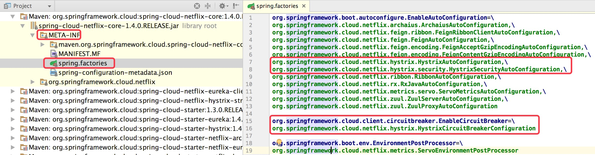
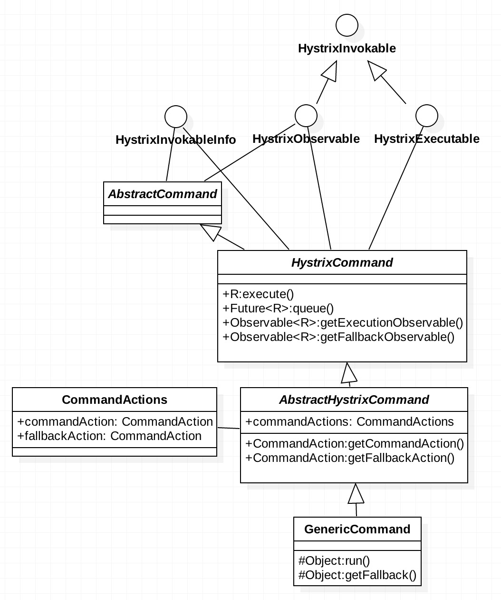

# Hystrix服务熔断，降级，限流

```text
Hystrix目的：微服务架构下，引入Hystrix机制，是为了保证整个系统的可用性；
```
```text
Hystrix场景分析-客户端调用者 调用 服务端提供者 有 4种类型：
1、1s内调用1次，即并发量很低时，客户端所有调用线程 都能调用成功，属于 '正常调用'；
2、1s内调用10次，即并发量提高时，客户端部分调用线程能调用成功，部分调用线程在队列中等待，属于 '限流'；
3、客户端调用者 部分调用线程在队列中等待，超过一定时间，会调用 自己的 降级方法，属于 '限流降级'；
4、客户端调用者 对某个 服务端提供者的某个接口 开启熔断状态，会调用 自己的 降级方法，属于 '熔断降级'；
```
```text
Http请求 结果状态：
1、请求 正常返回；
2、请求 执行超时；
3、请求 执行出错；
4、请求 未执行，因为 请求并发量超限，直接走降级方案，调用降级方法；
5、请求 未执行，因为 熔断开启，直接走降级方案，调用降级方法；
```
```text
基本概念：
①熔断：客户端调用者 根据策略来计算出服务是否需要开启熔断，开启熔断后一段时间内，不会再调用 服务提供者；正常情况下，熔断器处于关闭状态(Closed)，当调用
请求失败率达到阀值时，熔断器会处于开启状态，后续一段时间内的所有调用都会被拒绝，自动降级，走降级方案；一段时间以后，熔断器会尝试进入半熔断状态(Half-Open)，允许
少量请求调用服务端，如果调用仍然失败，则回到熔断状态，如果调用成功，则关闭熔断;
②降级：当并发数超限，发生错误，处于熔断状态等情况的时候，直接使用服务调用者自身配置的降级方案；
③限流：客户端调用者 自己主动限制 对 服务提供者 的调用；
```

```text
Hystrix资源隔离策略：
1、线程池 隔离策略：
    客户端调用者 调用 服务端提供者，客户端 为每个 服务端 创建一个线程池，调哪个服务端，就使用哪个线程池，将调用线程 封装到线程任务里，提交给线程池执行，线程池可以限制该线程任务的超时时间，如果超时，则走降级方法；
    如果线程池不隔离，只使用同一个线程池，那么线程池里的 工作线程可能都被 同一个服务端的调用占领；
2、信号量 隔离策略：
    客户端调用者 调用 服务端提供者，客户端 为每个 服务端 创建一个信号量(计数器)，不同服务有不同的信号量，调用线程 获取到 信号就执行，获取不到信号就 走降级方法；
```

### 原生 HystrixCommand 实现 调用的 限流 熔断 降级
```text
流程：
1、外部请求 lesson-5-website服务的 TestController类的 /test接口 和 /test_hystrix接口；
2、lesson-5-website 作为客户端调用者 调用 sms-interface服务的 /hystrix/timeout接口；
3、lesson-5-sms-interface 作为服务提供者，定义 SmsController类，提供 /sms接口；
```

```xml
<!--使用 原生的hystrix组件进行限流，需要引入 hystrix-core包，如下：原生hystrix不好用，一般不直接使用；-->
<dependency>
    <groupId>com.netflix.hystrix</groupId>
    <artifactId>hystrix-core</artifactId>
    <version>1.5.12</version>
</dependency>
```
```java
/**2：
* /test接口调用 sms-interface服务的/hystrix/timeout接口 未开启熔断
* /test_hystrix 接口调用 sms-interface服务的/hystrix/timeout接口 开启了熔断
* */
@RestController
public class TestController {
	@RequestMapping("test")
	public String test() throws IOException{
	    // 调用sms-interface服务的/hystrix/timeout接口，未开启限流熔断，不管是否稳定，会一直请求，占用服务器资源，造成雪崩
		URL url = new URL("http://localhost:9002/hystrix/timeout"); 
		byte[] result = new byte[1024];
		url.openStream().read(result);
		return new String(result);
	}
	
	@RequestMapping("test_hystrix")
	public String test_hystrix() throws IOException{
	    /**SmsSendCommand继承 HystrixCommond，将 调用sms-interface服务的/hystrix/timeout接口 封装到SmsSendCommand.run()方法中 execute()会触发run()方法执行*/
		return new SmsSendCommand().execute();  
	}
}
/**
 * htstrix属于命令模式：定义一个类 继承HystrixCommand 将 调用封装到 HystrixCommand的 run()方法中，execute()方法会触发run()方法，当run()方法限流
 * 或者熔断时，调用 降级方法getFallback()，不会继续执行run()；
 * */
public class SmsSendCommand extends HystrixCommand<String> {
	protected SmsSendCommand() {
		super(Setter
				/**CommandGroupKey与服务名一致，表示 要熔断的 服务*/
				.withGroupKey(HystrixCommandGroupKey.Factory.asKey("smsGroup"))
				/**CommandKey与 服务接口名一致 表示 要熔断的 服务接口*/
				.andCommandKey(HystrixCommandKey.Factory.asKey("smsCommandKey"))
				/**线程池命名，默认是HystrixCommandGroupKey的名称，线程池配置就是根据这个名称；此处 显示配置为smsThreadPool，没有使用默认名*/
				.andThreadPoolKey(HystrixThreadPoolKey.Factory.asKey("smsThreadPool"))
				/**以上配置 告诉hystrix，命令在哪个线程池执行*/
				/*command 熔断相关参数配置*/
				.andCommandPropertiesDefaults(HystrixCommandProperties.Setter()
				// 配置隔离方式：默认采用线程池隔离。还有一种信号量隔离方式,
				// .withExecutionIsolationStrategy(HystrixCommandProperties.ExecutionIsolationStrategy.SEMAPHORE)
				// 超时时间500毫秒
				// .withExecutionTimeoutInMilliseconds(500)
				// 信号量隔离的模式下，最大的请求数。和线程池大小的意义一样
				// .withExecutionIsolationSemaphoreMaxConcurrentRequests(2)
				// 熔断时间（熔断开启后，各5秒后进入半开启状态，试探是否恢复正常）
				// .withCircuitBreakerSleepWindowInMilliseconds(5000)
				)
				/**设置线程池大小*/
				.andThreadPoolPropertiesDefaults(HystrixThreadPoolProperties.Setter()
						/**设置线程池大小；此处表示该线程池只能存一个任务，同一时刻只能将一个http请求映射到run()方法进行具体操作，其他http请求都映射
						 * 到getFallback()方法，进行降级处理*/
						.withCoreSize(1)));
	}

	@Override
	protected String run() throws Exception {
		 URL url = new URL("http://localhost:9002/hystrix/timeout");    //调用sms-interface服务的/hystrix/timeout接口
		// 请求一个会随机报错的接口，用来做熔断的演示
//		URL url = new URL("http://localhost:9002/hystrix/exception");
		byte[] result = new byte[1024];
		url.openStream().read(result);
		return new String(result);
	}

	@Override
	protected String getFallback() {    //降级方法
		return "降级";
	}
}
```

```java
/**3
* sms-interface 作为服务提供者 里面定义TestController类，提供 /timeout接口，模拟响应超时，提供 /exception接口，模拟网络不稳偶尔报错；
* */
@RestController
public class TestController {
	@RequestMapping("test")
	public String test() throws IOException{
		// 普通方式调用接口，此处没有使用hystrix限流，不管接口稳不稳定，会一直请求，占用服务器资源，造成雪崩
		URL url = new URL("http://localhost:9002/hystrix/timeout");
		byte[] result = new byte[1024];
		url.openStream().read(result);
		return new String(result);
	}
}
```
```text
继承：
小圈大圈图 + 大圈子类构造方法默认调用小圈父类无参构造super()，除非它里面调用小圈父类有参构造super(参数)；子类持有 父类对象引用super 为成员变量；
调用大圈子类成员变量(son.name)和方法(son.setName())时，有则直接调用，没有则去小圈父类super中查找，如果小圈父类有该成员变量或方法，又没有使用
private修饰，则可以直接调用，否则不能调用；小圈父类中private修饰的方法不能被大圈子类所继承重写；
```

```text
测试请求超时，请求超过2秒没有返回值则为超时，config.properties配置如下：
hystrix.command.default.execution.isolation.thread.timeoutInMilliseconds=2000
发get请求 http://localhost:8080/test_hystrix，到SmsSendCommand类的run()方法，该方法里面调用http://localhost:9002/hystrix/timeout，该请求里面
睡眠 3秒，因此2秒内没有返回值，已超时，服务调用者website自动调用SmsSendCommand类的getFallback()方法；
```
```text
测试：请求异常后，客户端自动开启熔断；config.properties配置如下：
hystrix.command.default.circuitBreaker.requestVolumeThreshold=3     #一定时间内，调用某个服务，达到一定数量，才会开启熔断
发get请求 http://localhost:8080/test_hystrix，到SmsSendCommand类的run()方法，该方法里面调用http://localhost:9002/hystrix/exception，一定时间内
lesson-5-website 调用 lesson-5-sms-interface 达到3次，调用端自动开启熔断，直接调用 服务端lesson-5-sms-interface的熔断方法，再一定时间后，客户端
lesson-5-website关闭 服务端lesson-5-sms-interface的熔断，服务端恢复可用；
```

```properties
## 常用的熔断配置：配置在客户端，只需要配置请求超时时间，和线程池，其他使用默认配置即可
hystrix.command.default.metrics.rollingStats.timeInMilliseconds=5000        #客户端 调用 服务端 的请求超时时间
#客户端 将请求封装到线程任务中，然后将线程任务提交到线程池，线程池里面 真正 发送请求调用服务端
hystrix.threadpool.default.coreSize=1                                       #客户端 线程池中 工作线程数量
hystrix.threadpool.default.maxQueueSize=200                                 #客户端 线程池中 任务队列长度，即可容纳200个线程任务 等待执行
```

### Springcloud 集成 hystrix，hystrix集成 RestTemplate + Ribbon，hystrix集成 Feign
```xml
<!--lesson-5-hystrix-->
<dependency>
    <groupId>org.springframework.cloud</groupId>
    <artifactId>spring-cloud-starter-hystrix</artifactId>
</dependency>
```
```java
/**lesson-5-hystrix*/
@SpringBootApplication
@EnableFeignClients
@EnableCircuitBreaker	// 启用熔断机制
@EnableEurekaClient
public class HystrixSampleApplication {
	public static void main(String[] args) {
		new SpringApplicationBuilder(HystrixSampleApplication.class).web(true).run(args);
	}
}
```
### hystrix与 RestTemplate + Ribbon集成：
```text
背景描述：lesson-5-hystrix项目作为 客户端调用者，lesson-5-sms-interface项目作为 服务端提供服务，在客户端lesson-5-hystrix设置熔断，限流，降级方案；
流程：
1、外部请求访问 lesson-5-hystrix项目的TestResttemplateController.java类中 /timeout接口或者/exception；url：http://localhost:8081/resttemplate/timeout | /exception
2、上述接口里面 通过 RestTemplate + Ribbon调用 lesson-5-sms-interface项目的TestFeignController类的 /hystrix/timeout或者/hystrix/exception接口
3、lesson-5-hystrix作为 客户端调用者，要在 application.yml中配置 ？？？；
```
```java
@RestController
@RequestMapping("/resttemplate")
@Configuration
public class TestResttemplateController {
    @Bean
    @LoadBalanced // 这个注解一定要加，不然LoadBalancerAutoConfiguration不会对它进行处理
    RestTemplate RestTemplate() {
        return new RestTemplate();
    }
    
    @Autowired
    RestemplateSmsClient restemplateSmsClient;

    @RequestMapping("/timeout")
    public String timeout() {
        String body = restemplateSmsClient.timeout("参数时间:" + System.currentTimeMillis());
        return body;
    }

    @RequestMapping("/exception")
    public String exception() {
        String body = restemplateSmsClient.exception();
        return body;
    }
}
// 和resttemplate集成时，需要使用hystrixCommand注解对应的方法
// @HystrixCommand注解中可配置的项和其他的使用方式一样
@Component
class RestemplateSmsClient {
	@Autowired
	RestTemplate restTemplate; // spring内置,封装了http请求的工具类

	@HystrixCommand(                                    /**@HystrixCommand 客户端调用 配置 限流 熔断 降级*/
			fallbackMethod = "callTimeoutFallback",     /**降级方法*/
			threadPoolProperties = {                    /**采用线程池隔离策略*/
					@HystrixProperty(name = "coreSize", value = "1"),
					@HystrixProperty(name = "queueSizeRejectionThreshold", value = "1")
			},
			commandProperties = {
				@HystrixProperty(
						name = "execution.isolation.thread.timeoutInMilliseconds",
						value = "5000")
			}
	)
	public String timeout(String tempParam) {
		return restTemplate.getForObject("http://lesson-5-sms-interface/hystrix/timeout", String.class);
	}

	/**降级方法*/
	public String callTimeoutFallback(String tempParam) {
		return "这个是请求hystrix/timeout接口失败后的回调,加上一个没什么卵用的参数： " + tempParam ;
	}

	@HystrixCommand(fallbackMethod = "callExceptionFallback")
	public String exception() {
		return restTemplate.getForObject("http://lesson-5-sms-interface/hystrix/exception", String.class);
	}

	/**降级方法*/
	public String callExceptionFallback() {
		return "这个是请求hystrix/exception接口失败后的回调";
	}

	/**
	 * 实际上，任意的方法上面我们都可以使用 @HystrixCommand进行注解，将这个方法包装成一个hystrix的命令去执行，实现 远程调用熔断；
	 * 比如我们可以在数据库操作上面加上这个注解，来实现数据库操作的熔断。
	 */
	 @HystrixCommand
	 public String doSome() {
	 // TODO 这里可以写数据库操作， 写redis操作等等...都可以使用hystrixCommand进行封装。
		 return null;
	 }
}
```
### hystrix与Feign集成：
```text
背景描述：lesson-5-hystrix项目作为 客户端调用者，lesson-5-sms-interface项目作为 服务端提供服务，在客户端lesson-5-hystrix设置熔断，限流，降级方案；
流程：
1、外部请求访问 lesson-5-hystrix项目的TestFeignController类中 /timeout接口或者/exception；url：http://localhost:8081/feign/timeout | /exception
2、上述接口里面 通过 feign调用 lesson-5-sms-interface项目的TestFeignController类的 /hystrix/timeout或者/hystrix/exception接口
3、lesson-5-hystrix作为 客户端调用者，要在 application.yml中配置 feign的熔断；
```
```java
/**1 */
@RestController
@RequestMapping("/feign")
public class TestFeignController {
    @Autowired
    FeignSmsClient feignSmsClient;

    @RequestMapping("/timeout")
    public String timeout() {
        String body = feignSmsClient.timeout("参数时间:" + System.currentTimeMillis());
        return body;
    }

    @RequestMapping("/exception")
    public String exception() {
        String body = feignSmsClient.exception();
        return body;
    }
}
@FeignClient(name = "lesson-5-sms-interface", fallbackFactory = SmsFallBackFactory.class)
@Component
interface FeignSmsClient {
	@RequestMapping(value = "/hystrix/timeout", method = RequestMethod.GET)
	public String timeout(String tempParam);

	@RequestMapping(value = "/hystrix/exception", method = RequestMethod.GET)
	public String exception();
}
@Component
class FeignSmsFallbackClient implements FeignSmsClient {

	@Override
	public String timeout(String tempParam) {
		return "调用timeout接口失败，导致降级";
	}

	@Override
	public String exception() {
		return "调用有异常的接口，导致降级";
	}
}
```
```java
/**2 */
@Controller
@RequestMapping("/hystrix")
public class TestController {

	/**模拟调用接口，响应超时*/
	@ResponseBody
	@RequestMapping("/timeout")
	public String timeOut() throws InterruptedException {
		Thread.sleep(5000L);    // 睡眠3秒，模拟超时
		return "ok";
	}

	/**模拟网络不稳定，出现报错，偶尔失败偶尔失败*/
	@RequestMapping("/exception")
	public String exception(HttpServletResponse servletResponse) throws InterruptedException, IOException {
		if (new Random().nextInt(1000) % 2 == 0) {
			// 随机设置响应状态码为503，服务不可用的状态
			servletResponse.setStatus(503);
			servletResponse.getWriter().write("error");
			servletResponse.flushBuffer();
		} else {
			servletResponse.setStatus(200);             // 返回正常
			servletResponse.getWriter().write("ok");
			servletResponse.flushBuffer();
		}
		return "";
	}
}
```

```yaml
# 3
ribbon:
  # 开启eureka与ribbon的集成
  eureka:
    enabled: true
  # 开启熔断机制
  hystrix: 
    enabled: true
  # 配置ribbon默认的超时时间
  ConnectTimeout: 5000
  ReadTimeout: 5000
  # 是否开启重试
  OkToRetryOnAllOperations: true
  # 重试期间，实例切换次数
  MaxAutoRetriesNextServer: 0
  # 当前实例重试次数
  MaxAutoRetries: 0
feign:
  hystrix:
    enabled: true        # 开启feign的熔断机制
hystrix:
  threadpool:
    # 下面是默认的配置，暂时不用关心
    default:
      coreSize: 1
      maxQueueSize: 200
      queueSizeRejectionThreshold: 2
  command:
    # 这是默认的配置
    default:
      execution:
        timeout:
          enabled: true
        isolation:
          strategy: THREAD
          thread:
            timeoutInMilliseconds: 1000
            interruptOnTimeout: true
            interruptOnFutureCancel: false
          semaphore:
            maxConcurrentRequests: 2
      fallback:
        enabled: true
        isolation:
          semaphore:
            maxConcurrentRequests: 10
      circuitBreaker:
        enabled: true
        forceOpen: false
        forceClosed: false
        requestVolumeThreshold: 3
        errorThresholdPercentage: 50
        sleepWindowInMilliseconds: 10000
      metrics:
        rollingStats:
          timeInMilliseconds: 5000
          numBuckets: 10
        rollingPercentile:
          enabled: true
          timeInMilliseconds: 60000
          numBuckets: 6
          bucketSize: 100
        healthSnapshot:
          intervalInMilliseconds: 500
```

```text
测试：
测试TestFeignController类对外提供的接口：发送get请求 http://localhost:8081/feign/timeout
```

### hystrix工作流程
```text
1、创建 熔断器Hystrix；
3、缓存是否有效，有效则直接使用缓存；
4、调用某服务，判断 对该服务是否开启熔断，熔断器默认关闭，当调用该服务失败达到阈值后，会 对该服务开启熔断，过一定时间，对该服务开启半熔断状态，让一部分请求，如果返回正常，关闭熔断，否则继续开启熔断；
8、开启熔断，走 降级方案；
5、没开启熔断，将请求 封装到 线程中，将任务线程提交给 线程池执行，或者 请求要获得信号才能执行；信号量就是一个n+锁；
6、没有达到 线程池 或者 信号量的阈值，则 正常调用 服务端；
7、偶尔上报 度量信息 给 calculate circuit health，评估是否开启熔断；
```


## Hystrix 源码
```java
/**springcloud通过 HystrixCommand类实现 限流 熔断 降级，该类要想使用，必须先实例化，因此先跟其 构造方法，如下；注意：抽象类不能 new，必须定义继承子类，才能new*/
public abstract class HystrixCommand<R> extends AbstractCommand<R> implements HystrixExecutable<R>, HystrixInvokableInfo<R>, HystrixObservable<R> {
    protected HystrixCommand(HystrixCommandGroupKey group) {
        super(group, null, null, null, null, null, null, null, null, null, null, null);
    }
}
/**跟super到AbstractCommand的构造方法，该构造方法完成一些初始化操作，HystrixCommand的所有实现类 实例化时，都会执行 这些初始化方法 */
abstract class AbstractCommand<R> implements HystrixInvokableInfo<R>, HystrixObservable<R> {
    protected AbstractCommand(HystrixCommandGroupKey group, HystrixCommandKey key, HystrixThreadPoolKey threadPoolKey, HystrixCircuitBreaker circuitBreaker, HystrixThreadPool threadPool,
            HystrixCommandProperties.Setter commandPropertiesDefaults, HystrixThreadPoolProperties.Setter threadPoolPropertiesDefaults,
            HystrixCommandMetrics metrics, TryableSemaphore fallbackSemaphore, TryableSemaphore executionSemaphore,
            HystrixPropertiesStrategy propertiesStrategy, HystrixCommandExecutionHook executionHook) {

        //...
        /**度量器：收集数据，计算结果*/
        this.metrics = initMetrics(metrics, this.commandGroup, this.threadPoolKey, this.commandKey, this.properties);
        /**熔断器：管理 所有服务的所有接口 的熔断状态(关闭，开启，半开启，强制开启，强制关闭)；注意：熔断的是 服务的某个接口，不是整个服务*/
        this.circuitBreaker = initCircuitBreaker(this.properties.circuitBreakerEnabled().get(), circuitBreaker, this.commandGroup, this.commandKey, this.properties, this.metrics);
        /**每个命令组 即每个要调用服务 都有一个线程池*/
        this.threadPool = initThreadPool(threadPool, this.threadPoolKey, threadPoolPropertiesDefaults);

       //...
    }
}
/**定义 SmsSendCommand类 继承 HystrixCommand，SmsSendCommand类实例化的时候，会执行上面的初始化操作，初始化 度量器，熔断器，线程池等；
*  SmsSendCommand类 继承了HystrixCommand类的 execute()方法，这是一个入口方法
* */
public class SmsSendCommand extends HystrixCommand<String> {
    public R execute() {
        try {
            return queue().get();   //queue()返回Future 即异步计算结果集，future.get()同步等待计算结果；
        } catch (Exception e) {}
    }
}
/**将返回结果封装到 Future(封装异步计算结果)中，实现多线程操作；toObservable().toBlocking().toFuture();中 toBlocking().toFuture()负责创建Future，为了达到异步效果，进行多线程封装；
* toObservable()负责缓存处理，hystrix中多线程编程框架 rxJava 使用观察者模式，跟 AbstractCommand#toObservable()
* */
public abstract class HystrixCommand<R> extends AbstractCommand<R> implements HystrixExecutable<R>, HystrixInvokableInfo<R>, HystrixObservable<R> {
    public Future<R> queue() {
        /*
         * The Future returned by Observable.toBlocking().toFuture() does not implement the
         * interruption of the execution thread when the "mayInterrupt" flag of Future.cancel(boolean) is set to true;
         * thus, to comply with the contract of Future, we must wrap around it.
         */
        final Future<R> delegate = toObservable().toBlocking().toFuture(); 
        //...
    }
}
abstract class AbstractCommand<R> implements HystrixInvokableInfo<R>, HystrixObservable<R> {
    public Observable<R> toObservable() {
        //...
        return Observable.defer(new Func0<Observable<R>>() {
            @Override
            public Observable<R> call() {
                 /* this is a stateful object so can only be used once */
                if (!commandState.compareAndSet(CommandState.NOT_STARTED, CommandState.OBSERVABLE_CHAIN_CREATED)) {  //命令状态
                   //...
                }
                if (properties.requestLogEnabled().get()) {     //从配置文件判断日志是否开启
                    if (currentRequestLog != null) {
                        currentRequestLog.addExecutedCommand(_cmd);
                    }
                }
                //判断是否开启缓存 key-value 形式，请求中应该有一个 key，判断map中是否有value
                final boolean requestCacheEnabled = isRequestCachingEnabled();
                final String cacheKey = getCacheKey();

                /* try from cache first */
                if (requestCacheEnabled) {
                    HystrixCommandResponseFromCache<R> fromCache = (HystrixCommandResponseFromCache<R>) requestCache.get(cacheKey);
                    //...
                }
                Observable<R> hystrixObservable = Observable.defer(applyHystrixSemantics).map(wrapWithAllOnNextHooks);
                Observable<R> afterCache;
                // put in cache
                if (requestCacheEnabled && cacheKey != null) {
                   //...
                } else {
                    afterCache = hystrixObservable;
                }

                return afterCache
                        .doOnTerminate(terminateCommandCleanup)     // 事件源 注册监听器terminateCommandCleanup，当Terminate事件发生时，调用监听方法doOnTerminate()
                        .doOnUnsubscribe(unsubscribeCommandCleanup) // 事件源 注册监听器unsubscribeCommandCleanup
                        .doOnCompleted(fireOnCompletedHook);        // 事件源 注册监听器fireOnCompletedHook
            }
        });
    }
    //4 熔断器是否打开
    private Observable<R> applyHystrixSemantics(final AbstractCommand<R> _cmd) {
        executionHook.onStart(_cmd);

        /* circuitBreaker 熔断器 determine if we're allowed to execute 重点，跟 circuitBreaker.attemptExecution()返回true表示执行，返回false表示不执行*/
        if (circuitBreaker.attemptExecution()) { //没有开启熔断，执行如下代码
            final TryableSemaphore executionSemaphore = getExecutionSemaphore();
            final AtomicBoolean semaphoreHasBeenReleased = new AtomicBoolean(false);
            final Action0 singleSemaphoreRelease = new Action0() {
                @Override
                public void call() {
                    if (semaphoreHasBeenReleased.compareAndSet(false, true)) {
                        executionSemaphore.release();
                    }
                }
            };

            final Action1<Throwable> markExceptionThrown = new Action1<Throwable>() {
                @Override
                public void call(Throwable t) {
                    eventNotifier.markEvent(HystrixEventType.EXCEPTION_THROWN, commandKey);
                }
            };

            if (executionSemaphore.tryAcquire()) {
                try {
                    /* used to track userThreadExecutionTime */
                    executionResult = executionResult.setInvocationStartTime(System.currentTimeMillis());
                    return executeCommandAndObserve(_cmd)
                            .doOnError(markExceptionThrown)
                            .doOnTerminate(singleSemaphoreRelease)
                            .doOnUnsubscribe(singleSemaphoreRelease);
                } catch (RuntimeException e) {
                    return Observable.error(e);
                }
            } else {
                return handleSemaphoreRejectionViaFallback();
            }
        } else { //开启熔断 执行如下代码 执行 降级方法；
            return handleShortCircuitViaFallback();
        }
    }
}
```

```text
配置信息封装在 HystrixCommandProperties，HystrixPropertiesFactory，HystrixCommandConfiguration
```


```text
SpringCloud集成 Hystrix：
Spring中也有一种类似 Java SPI的加载机制，允许在 META-INF/spring.factories 文件中配置接口实现类，Spring 会自动处理。开发人员仅需引入 jar 包，就能达到插拔式效果，十分方便。
引入 spring-cloud-starter-hystrix 依赖，spring-cloud-netflix-core 的 jar 包中包含 spring.factories 文件，其中有 Hytrix 和 其他组件相关配置。
```

```java
/**
* 将依赖包中的 类加载到 当前IOC容器；实例化的 HystrixCommandAspect，是一个切面类 拦截加了@HystrixCommand注解的方法，做环绕处理；
* */
@Configuration
public class HystrixCircuitBreakerConfiguration {
	@Bean
	public HystrixCommandAspect hystrixCommandAspect() {
		return new HystrixCommandAspect();
	}
	//...
}
/**
* 跟 HystrixCommandAspect类
* HystrixCommandAspect，是一个切面类 拦截加了@HystrixCommand注解的方法，做环绕处理*/
@Aspect
public class HystrixCommandAspect {
    @Around("hystrixCommandAnnotationPointcut() || hystrixCollapserAnnotationPointcut()")
    public Object methodsAnnotatedWithHystrixCommand(final ProceedingJoinPoint joinPoint) throws Throwable {
        // 被@HystrixCommand标记的 方法
        Method method = getMethodFromTarget(joinPoint);
        if (method.isAnnotationPresent(HystrixCommand.class) && method.isAnnotationPresent(HystrixCollapser.class)) {
            throw new IllegalStateException("method cannot be annotated with HystrixCommand and HystrixCollapser annotations at the same time");
        }
        MetaHolderFactory metaHolderFactory = META_HOLDER_FACTORY_MAP.get(HystrixPointcutType.of(method));
        MetaHolder metaHolder = metaHolderFactory.create(joinPoint);
        // 准备各种材料后，创建HystrixInvokable；HystrixInvokable 只是一个空接口，没有任何方法，只是用来标记具备可执行的能力；
        HystrixInvokable invokable = HystrixCommandFactory.getInstance().create(metaHolder);
        ExecutionType executionType = metaHolder.isCollapserAnnotationPresent() ? metaHolder.getCollapserExecutionType() : metaHolder.getExecutionType();

        Object result;
        try {
            if (!metaHolder.isObservable()) {
                // 利用工具CommandExecutor来执行
                result = CommandExecutor.execute(invokable, executionType, metaHolder);
            } else {
                result = executeObservable(invokable, executionType, metaHolder);
            }
        } catch (HystrixBadRequestException e) {
            throw e.getCause() != null ? e.getCause() : e;
        } catch (HystrixRuntimeException e) {
            throw hystrixRuntimeExceptionToThrowable(metaHolder, e);
        }
        return result;
    }
}
/**HystrixInvokable 又是如何创建的？它具体的实现类又是什么？ 跟 HystrixCommandFactory.getInstance().create(metaHolder);
* 三个抽象父类 AbstractHystrixCommand、HystrixCommand、AbstractCommand 帮助 GenericCommand 做了不少公共的事情，而 GenericCommand 负责执行具体的 run()方法和fallback()方法。
* */
public class HystrixCommandFactory {
    public HystrixInvokable create(MetaHolder metaHolder) {
        HystrixInvokable executable;
        if (metaHolder.isCollapserAnnotationPresent()) {
            executable = new CommandCollapser(metaHolder);
        } else if (metaHolder.isObservable()) {
            executable = new GenericObservableCommand(HystrixCommandBuilderFactory.getInstance().create(metaHolder));
        } else {
            executable = new GenericCommand(HystrixCommandBuilderFactory.getInstance().create(metaHolder));
        }
        return executable;
    }
}
```


```java
/**目标方法执行细节，执行过程想来应该很简单，即先执行目标方法，失败则执行fallback方法；
再来看看 methodsAnnotatedWithHystrixCommand() 的具体执行代码，它完成了 Hystrix 的整个执行过程*/
public class CommandExecutor {
    public static Object execute(HystrixInvokable invokable, ExecutionType executionType, MetaHolder metaHolder) throws RuntimeException {
        switch (executionType) {
            // 这里仅贴出这一种case  
            case SYNCHRONOUS: {
                // 转为 HystrixExecutable 并执行
                return castToExecutable(invokable, executionType).execute();
            }
        }
    }
}
/**HystrixExecutable 的 execute() 方法由 HystrixCommand.execute() 实现*/
public interface HystrixExecutable<R> extends HystrixInvokable<R> {
    public R execute() {
        // 调用下面的queue()
        return queue().get();
    }

    public Future<R> queue() {
        final Future<R> delegate = toObservable().toBlocking().toFuture();
        final Future<R> f = new Future<R>() { //... };
    
        if (f.isDone()) {
            try {
                f.get();
                return f;
            }
        }
    
        return f;
    }
}
```

```text
利用 JUC 的 Future 来异步执行，通过 f.get() 来获取 timeout() 方法的执行结果。Hystrix 结合了 RxJava 来实现异步编程，我做了下调试，看了stackframe，执行过程层层调用，略微恶心。RxJava 有点复杂，同时也需要了解响应式编程模型，这里直接跳过。
TestResttemplateController 的 timeout() 还是由 GenericCommand 来执行的，如下图，getCommandAction() 这个 CommandAction 指的就是被执行的timeout()方法，利用Java反射机制来执行。
下图右边部分标记出来的就是 RxJava 中的部分调用链，下面的截图简单展示下最后的调用；
OnSubscribeDefer.call() -> HystrixCommand.getExecutionObservable() -> GenericCommand.run()；
```
