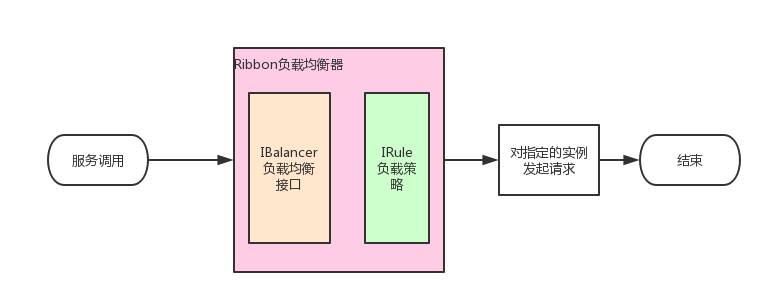

#Ribbon 客户端负载均衡
```text
客户端负载均衡：
一个服务，多个实例，如何选择调用实例？调用实例之前，先去eureka服务端 获取该服务的所有实例，根据Ribbon的负载均衡策略，选择一个合适的实例，然后发起请求调用该实例；
```



```text
Ribbon 3种配置方式：
1、application.yml中直接配置；2、@Bean；3、ribbon与eureka集成使用；
 ```
服务名.实例列表：service-by-properties.listOfServers=
http://www.csdn.net , http://www.baidu.com , http://www.dongnaoedu.com，表示service-by-properties
服务有 3个实例

service-by-annotation服务的实例在ServiceByAnnontationConfiguration中；
③application.yml配置文件中：ribbon.eureka.enabled=true，表示开启 ribbon与eureka集成；
举例：
创建 maven子模块 lesson-4-eureka服务作为 eureka服务端，并启动；
创建 maven子模块 lesson-4-ribbon服务作为 eureka客户端 获取服务，pom.xml里面引入s-c-s-ribbon
<dependency>
    <groupId>org.springframework.cloud</groupId>
    <artifactId>spring-cloud-starter-ribbon</artifactId>
</dependency>
启动类 RibbonSampleApplication如下：
配置文件 application.yml 详情见注释，里面包括 ①③配置形式；
②配置形式通过在启动类RibbonSampleApplication上加注解，如下：
@RibbonClients(value = {
		@RibbonClient(name = "service-by-annotation", configuration = ServiceByAnnontationConfiguration.class) })
该注解表示 service-by-annotation的负载均衡器，负载均衡的配置在ServiceByAnnontationConfiguration
里面，该类如下，注意，这个类创建spring容器中的实例对象，但是没有加 @Configuration注解，表示其创建实例
对象 存到 子容器：


```yaml
# 1、application.yml中直接配置；
service-by-properties:            # 请求 service-by-properties服务时，从下面服务列表找
  listOfServers: http://www.csdn.net,http://www.baidu.com,http://www.dongnaoedu.com # 服务实例列表
  MaxAutoRetriesNextServer: 0           # 这个负载均衡器不做重试
  MaxAutoRetries: 0
  ribbon:
    NFLoadBalancerRuleClassName: com.netflix.loadbalancer.RoundRobinRule            # 负载策略
    NIWSServerListClassName: com.netflix.loadbalancer.ConfigurationBasedServerList  # 设置它的服务实例信息来自配置文件, 如果不设置NIWSServerListClassName就会去euereka里面找
```
```java
//启动类使用@RibbonClients注解：
@RibbonClients(value = {@RibbonClient(name = "service-by-annotation", configuration = ServiceByAnnontationConfiguration.class) })
public class RibbonSampleApplication {
    //...
}
public class ServiceByAnnontationConfiguration {
	// 实例源
	// service-by-annotation
	@Bean
	public ServerList<Server> ribbonServerList() {
		// 实例列表
		String listOfServers = "http://www.csdn.net,http://www.baidu.com,http://www.dongnaoedu.com";
		String[] splits = listOfServers.split(",");
		int len = splits.length;
		if (len == 0) {
			return new StaticServerList<Server>();
		}

		Server[] servers = new Server[len];
		for (int i = 0; i < len; i++) {
			servers[i] = new Server(splits[i].trim());
		}
		// 返回这个...静态的
		return new StaticServerList<Server>(servers);
	}

	// 负载策略
	@Bean
	public IRule iniRule() {
		// 随机
		return new RandomRule();
	}
}
```
```yaml
# 3、ribbon通过eureka进行负载均衡
ribbon:
  eureka:
    enabled: true                 # 开启eureka与ribbon的集成
  hystrix: 
    enabled: false                # 暂不开启熔断机制
  ConnectTimeout: 2000            # 配置ribbon默认的超时时间
  ReadTimeout: 2000
  OkToRetryOnAllOperations: true  # 是否开启重试
  MaxAutoRetriesNextServer: 3     # 重试期间，实例切换次数	 比如：100个实例，我只会在四个实例上面去重试
  MaxAutoRetries: 2               # 当前实例重试次数
```
ribbon 3种使用方式，在 way包：
①TestLoadBalancerClientController类，通过loadbalancerClient对象，选择服务的一个实例；
ServiceInstance serviceInstance = loadbalancerClient.choose("service-by-properties")
②TestResttemplateController类，通过restTemplate对象，选择服务的一个实例；
String body = restTemplate.getForObject("http://service-by-properties/", String.class);
③TestFeignController类

启动 lesson-4-ribbon服务，该服务作为 eureka客户端调用者，去调用服务实例，该例中服务为service-by-properties，
服务实例分别为：http://www.csdn.net , http://www.baidu.com , http://www.dongnaoedu.com